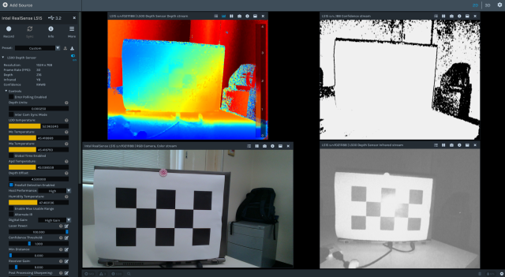
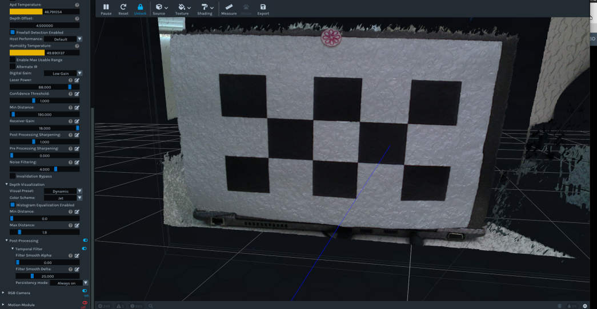
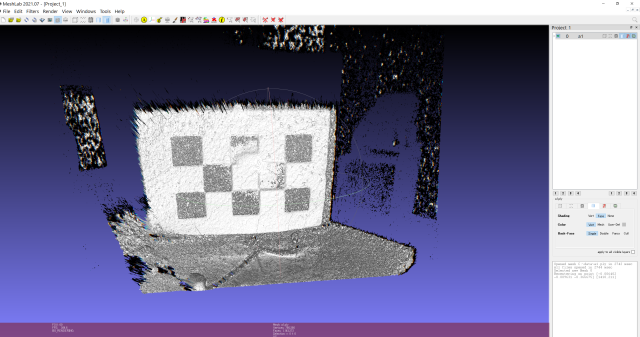
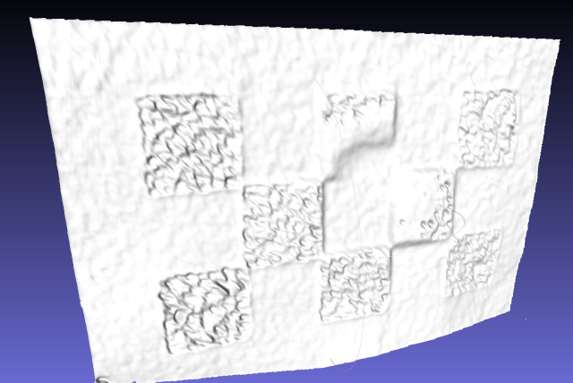

## .plyファイルの活用法検討

### ①meshlabから出力し、HWで読み込む場合
meshlabから各拡張子で出力し、HWで読み込んだ結果を下表に示す。

||meshlabの出力|HWでの読み込み|
|--|----|--|
|stl|可能|可能|
|obj|可能|3dsprintでstlに変換する必要あり|
|wrl|可能|3dsprintでstlに変換する必要あり|
|3ds|メッシュ数制限のため不可|-|
|dxf|可能|可能だがライン形状のみ|

### ②meshlabから出力し、HMで変換してHWで読み込む場合
HMで変換することでHWで読み込めたものを下表に示す。
HMでのサーフェス作成方法は　geom→surface→from FEでエレメントからサーフェス作成する。

||HMの出力|HWでの読み込み|
|--|--|--|
|iges|サーフェスを作成すれば可能|可能|
|jt|メッシュ・サーフェス共に可|メッシュ・サーフェス共に可|
|step|サーフェスを作成すれば可能|可能|
|x_t|サーフェスを作成すれば可能|可能（他と比べサーフェス形状がいびつだったように思う）|

### ③meshlabスムージング機能
・filters→smoothing, fairing and deformation→depth smooth

OpenViewの操作

MeshLabの操作

